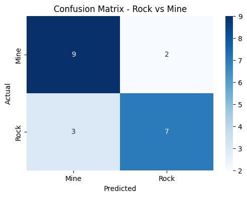
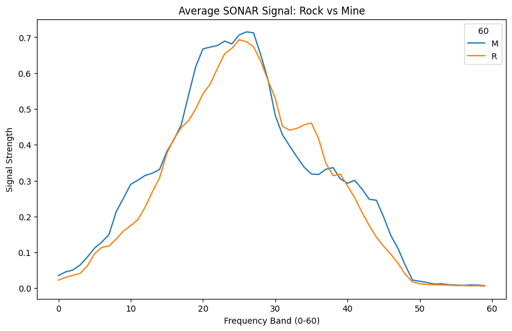

# 🌊 SONAR Rock vs Mine Prediction System

A Machine Learning model that classifies underwater objects as either **Rocks** or **Mines (Metal Cylinders)** using SONAR data. This project is designed to enhance submarine navigation and underwater safety by automating object detection.

## 🚀 Overview
The system uses sonar signals reflected off underwater objects. Each signal consists of 60 different frequency bands, which serve as features for our classification model.

- **Objective:** Distinguish between harmless rocks and explosive mines.
- **Algorithm:** Logistic Regression (Binary Classification).
- **Dataset:** UCI Machine Learning Repository - Sonar Dataset.

## 📊 Performance & Visualizations

### 1. Confusion Matrix
This shows how accurately the model predicted the test data.

### 2. Signal Analysis
The plot below compares the average frequency response of a Rock versus a Mine. Notice how the signals differ in the middle frequency bands!  
  

## 🛠️ Tech Stack
- **Language:** Python
- **Libraries:** NumPy, Pandas, Scikit-learn
- **Environment:** Jupyter Notebook / Google Colab

## 📈 Model Performance
- **Training Accuracy:** ~83%
- **Testing Accuracy:** ~76%

## ⚙️ How to Run
1. Clone the repo: `git clone https://github.com/Sibashis216/Rock-vs-Mine-Prediction.git`
2. Run the notebook: `jupyter notebook Rock_vs_Mine.ipynb`
